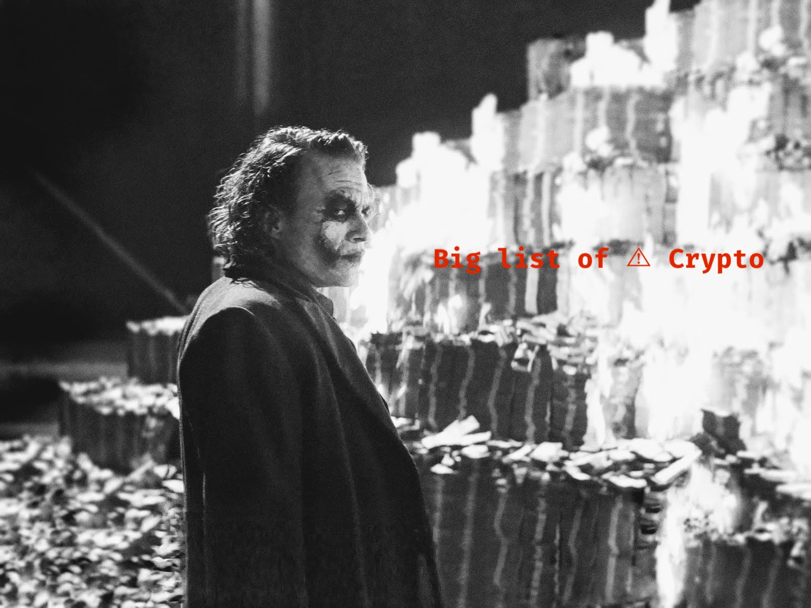

**[[Submit bad crypto](https://github.com/luijoy/big-list-of-bad-crypto/issues/new)]**

# 

## Big List of Bad Crypto

## Intention

Cryptocurrencies have the potential to do many good things. Unfortunately the cryptosphere is also rife with bad actors looking to take advantage of new adopters. With this list the goal is to maintain an exhaustive and evolving list of scam coins and tokens. This list could be useful as a database for other applications to piggy back off of or just for investors to keep handy and check before getting involved with a project.

## The Big List

* $PAIRNAME
* 5-Oct
* 10kCoin
* 16BIT
* 1CRedit
* 1Coin
* 2BACCO
* 2CHCoin
* 2FLAV
* 32BIT
* 365Coin
* 404
* 420G
* 500
* 666
* 66coin
* A3C
* A3M
* AAA
* AAAAA
* AAAAB
* AAATTtest
* ABJ
* ABOUT
* ACHK
* ACID
* ACLR
* ACMEBON2
* ACPR
* ACRN
* ACTION
* ACTIV5
* ADDON
* ADEPT
* ADMT
* ADOPTEDBTC
* ADPAY
* ADULT
* AEB
* AECC
* AEIOU
* AEO
* AFTER
* AGENT
* AGUA
* AIDE
* AIR
* AIRE
* AL
* ALB
* ALC
* ALIEN
* ALLAH
* ALP
* AMANA
* AMAZON
* AMBER
* AMIGO
* AMINE
* ANAL
* AND
* ANONS
* ANTHONY
* ANTI
* AOIO
* AOOII
* AOOIO
* AOOOI
* AOPEN
* APESO
* APH
* API Coin
* APP
* APPLE
* APPLECOIN
* AQUA
* AR2
* ARAB
* ARCoin
* ARD
* ARDER
* ARDORCHINA
* ARH
* ARIKA
* ARM
* ARPA
* ARTA
* ARTC
* ARUBA
* ASEAN
* ASIA
* ASIAN
* AST
* ATARI
* ATCapital
* ATEN
* ATH
* ATHENA2016
* ATLUS
* ATM
* ATO
* ATOMIC Asset
* AUDFIAT
* AUDGOLD
* AUDSILVER
* AUM
* AUS
* AVAYA
* AVC
* AWE
* AXIOM
* AXISCoin
* AbuDhabi
* Abundance
* Achilles
* Actifs
* Acura
* Adam Coin
* AdCoin
* Adel
* Adelp
* Adidas
* Admin
* Adobe
* Adultcoin
* Advertise
* Aegis
* Aegis
* AeroCoin
* AeroME
* Afghanista
* Aflac
* Afri
* Afric
* Africa
* Afro
* Agates
* Agreement
* Ahmedabad
* Aidbit
* Aiden
* Aiden
* AimCoin
* Airbnb
* Airport
* Alarm
* Alberta
* Album
* Alcohol
* Alexandria
* Algorithm
* Alias
* Alibaba
* AliceCoins
* AlienCoin
* Alipay
* Alipaycoin
* Aloha
* Alpha
* AlphaCoin
* Alphabet
* AlpsValue
* Altcoin
* America
* AmericanCoin
* Amero
* Amsterdam
* AnalShares
* Android
* Angel
* AngryBirds
* Anime
* Ankara
* Annuity
* AnonCoin
* Anonymity
* Anonymous
* Answer
* Antwerp
* ApexCoin
* Aplication
* ApolloCoin
* Aquaman
* Arcade
* ArchCoin v2
* Ardorcoin
* Argentina
* Aries
* Armani
* Armor
* Arrow
* ArtifIntel
* Artificial
* AscentCoin
* AsicCoin
* Asics
* AssetBull
* Astro
* AstroCoin
* Athena
* Athens
* Atlanta
* Atomic Points
* Atsala
* Auckland
* Auction
* Audi
* Audio
* Australia
* Austria
* AutismCoin
* AutoRacing
* Autos
* Avengers
* Award
* Axron
* B1BL3Coin
* B2
* b3
* BAB
* BAC
* BADcoin
* BAGIS
* BAHT
* BAIDU
* BAM
* BAN
* BANKCOIN
* BANKS
* BARCA
* BARR
* BATL
* BBL
* BBQCoin
* BCAT
* BCEAO
* BDG
* BDSMCoin
* BEA
* BEADS
* BEAN
* BEARS
* BEAST
* BEEP
* BEK
* BELI
* BETCOIN
* BFC
* BFX
* BGR
* BIGUP
* BIOSYNERGY
* BIRD
* BIRST
* BIT16
* BITBURGER
* BITCH
* BITCHIPS
* BITCNY
* BITEUR
* BITGLD
* BITPAY
* BITRD
* BITREAIS
* BITTN
* BITZ
* BIXC
* BIXEE
* BKS
* BKcoin
* BLACK
* BLADE
* BLIND
* BLING
* BLP
* BLRY
* BLTR
* BLTZ
* BLUE
* BM
* BN
* BOARD
* BOAT
* BOATS
* BOD
* BONDS
* BONES
* BOOBS
* BOOBY
* BOOKS
* BOT
* BOTTLECAPS
* BOUN
* BPOK
* BRA
* BRASS
* BRDD
* BRM
* BRONZ
* BSC
* BSDB
* BSTAR
* BSTK
* BT
* BTAPR
* BTAUG
* BTCARace1
* BTCARace2
* BTCARaurum
* BTCEMBASSY
* BTCO
* BTCRS
* BTCRY
* BTCU
* JOKER
* BTLC
* BTMAY
* BTR
* BTSR
* BTU
* BUB
* BUDDA
* BUDS
* BURGERAA
* BURRITO
* BUY
* BUZZ
* BVB
* BWC
* Backup
* Bacon
* BaconBitsCoin
* Baghdad
* Bahamas
* BaliCoins
* BancorCoin
* Bands
* Bandung
* Bangalore
* Bangkok
* Bangladesh
* BankCoin
* Banka
* BanksyCoin
* Banx shares
* BanxShares
* Barbecue
* Barcelona
* Rupee
* Baseball
* Basketball
* Batman
* BattleCoin
* Baxian
* Beans
* BeaoCoin
* BeerCoin
* Beijing
* Belarus
* Belgium
* BellsCoin
* Bengaluru
* Benjamins
* Bentley
* Berkeley
* Berlin
* Berry
* Bhutan
* Bible
* BigBang
* BigBangCoin
* BigBullion
* BikerCoin
* BilShares
* Billion
* BillionCoin
* Bills
* BingoCoins
* BirdCoin
* BitCash
* BitCent
* BitConnect
* BitCredits
* BitLion
* BitLitS
* BitMiles
* BitMo
* BitMoney
* BitShares
* BitShares DNS
* BitSharesX
* BitStake
* BitTorrent
* BitcoinInstant
* BUK COIN BUK2
* BitcointalkCoin
* Bitcoin Gold
* BitleuCoin
* Bitshares X
* Bitti
* Black Dragon Coin
* BlackHat
* BlackToken
* BlackWidow
* bitcore
* cream
* Blackjack
* Bladecoin
* BlakeBitcoin
* Blender
* Bleutrade Share
* Bliss
* Blogger
* Blogs
* Blood
* Bluetooth
* BluntCoin
* Boeing
* Bogota
* Bollywood
* BonusCoin
* BonusCoin
* BonusCoins
* BoomCoin
* Boost
* BoostCoin
* Booty
* Boozecoin
* Borgcoin
* BoriCoin
* Bosscoin
* Boston
* Bountycoin
* Boxing
* Brazil
* Bricks
* BritCoin
* Brooklyn
* Brown
* Brussels
* Buck
* BuenosAire
* Buick
* Bulgaria
* Bullion
* Bulls
* BumbaCoin
* Bunnycoin
* BurbuCoin
* Burgercoin
* Burma
* Busan
* Business
* ButtShares
* Bytecoin
* Bytes
* C-Note
* CAB
* CADFIAT
* CADGOLD
* CADSILVER
* CAI
* CAID
* CAJAMARCA
* CAKE
* CALC
* CALI
* CARDS
* CASHH
* CBD
* CBIT
* CBJMS
* CBolivar
* CCC
* CCS
* CD
* CDA
* CDIST
* CFC
* CFCV2
* CHCCoin
* CHEMX
* CHG
* CHINA
* CHOOF
* CHRG
* CIR
* CIRC
* CITY
* CK
* CKS
* CLAIM
* CLAMB
* CLC
* CLINT
* CLK
* CLN
* CLOA
* CLOUD
* CLUD
* CLV
* CMCSA
* CNYFIAT
* CNOTE
* CNYGOLD
* CNYNXT
* CNYSILVER
* COC
* COCOOKING
* COF
* COIN2
* COINZ
* COL-21xhipster
* BITCOINVESTMENT
* BitcoinCryptoCurrencySeriesA
* COLBOOKC
* COLBRL
* COLBTS
* COLCFS
* COLDDU
* COLF
* COLKLIPP
* COLMAZN
* COLMIC
* COLPEC
* COLX
* COLZOIDY
* CONIO
* CONX
* COPPER
* CORAL
* COULD
* COX
* CP
* CPT
* CPTCHILL
* CRAB
* CRAFT
* CRANK
* CRAP
* CRAZY
* CRE
* CREAK
* CREDIT
* CRIME
* CRNK
* CROWD
* CRS
* CRSALE
* CRTCoin
* CRTV
* CRX
* CRYPTEX
* CS
* CSA
* CSCoin
* CSH
* CT
* CTC
* CTK
* CTZ
* CUBA
* CUBE
* CUPON
* CURA
* CURVES
* CWorkCoin
* CX
* CYP
* CYT
* CZECO
* CZECoin
* Cable
* CacheCoin
* CaiShen
* Cairo
* CalTech
* California
* California Coin
* CallofDuty
* Cambridge
* Camcoin
* CAN
* Canada
* Candy
* Cannabis
* CannabisDark
* Cannabiscoin
* Cannacoin
* Cannacoin
* Canon
* CapeTown
* Capital
* CapitalCoin
* CaptCoin
* CaptKirk
* CaptMarvel
* Captain
* CarCoin
* Carat
* CarbonCoin
* CarbonEmissionTradeCoin
* Cardgame
* CarpeDiemCoin
* Carribbean
* Cartier
* Cash
* Casino
* CasinoCoin
* Cassubian Detk
* CataloniaCoin
* Catch
* Caviar
* CeBIT
* CebuCity
* Celebrity
* Cellphone
* Cents
* Cetuscoin
* Chain
* Champ
* Chance
* Chancecoin
* Chanel
* Changsha
* Chaos
* Charity
* Charm
* Chart
* Check
* CheckCoin
* CheckOutCoin
* Cheer
* ChefCoin
* Chemnitz
* Chengdu
* Chennai
* Chevy
* Chicago
* Chile
* Chillcoin
* Chongqing
* Chrome
* Cindercoin
* CinniCoin
* Circle
* Cisco
* Class
* CleanWaterCoin
* Clear
* ClearingHouse
* CleverHash
* Clock
* Clone
* Closure
* Cloudcoin
* Clout
* Clown
* Clubnxtfor
* Clubs
* ClusterCoin
* CoCoCoin
* Cobra
* CocaCola
* Cocoa
* Coffee
* CoffeeCoin v2
* CoinJoin
* CoinMarketsCoin
* CoinShield
* CoinShuffl
* CoinWorksCoin
* Coinflip
* Coino
* Coino
* CoinoUSD
* Coinomat
* College
* Colombia
* Color
* ColossusCoin
* Comet
* Comicbook
* Comicbooks
* Comics
* Community
* CommunityCoin
* CompSci
* Compute
* Computer
* Conceal
* ConcealCoin
* ConfessionCoin
* Connected
* Consolidated Mining
* ConspiracyCoin
* Continuumcoin
* Contract
* CoolCoin
* Coops
* Copenhagen
* CopperBars
* CopperLark
* Cornell
* CornerstoneCoin
* Cornn
* Cosmic
* Cosmo
* Cosmoscoin
* Counterpty
* Cover
* Covert
* Cplus
* CptAmerica
* CrackCoin
* Cracker
* CraigsCoin
* Craps
* Crash
* CreaRicco
* Credit
* Creditcard
* Credits
* Credits
* Croatia
* Cross
* Cryptcoin
* Crypti
* CryptoBancor
* CryptoBuck
* CryptoCity
* CryptoCurr
* CryptoFiat
* CryptoMeth
* Cryptocoin Inc. Shares
* CryptogenicBullion
* Cryptographic Anomaly
* Cryptolian
* CryptsyPoints
* CrystalCoin
* Cubic
* Cummingtonite
* Currency
* Cyber
* CyberTech
* Cyberspace
* Cyborg
* Cycle
* Cypher
* Cyprus
* Czarcoin
* CzechCrownCoin
* CzechRepub
* DANC
* DAO
* DARK
* DATASYN
* DBG
* DC
* DCK
* DCM
* DCOIN
* DCORP
* DCRE
* DClub
* DD
* DDF
* DEATH
* DECR
* DEEPBLUE
* DEN
* DENAR
* Denta Coin
* DES
* DETH
* DEUR
* DFQ
* DGCS
* DIATE
* DIBS
* DIC
* DIGS
* DINERO
* DIRHAM
* DIRT
* DISK
* DKC
* DKKCoin
* DLISK
* DMB
* DMark
* DMedia
* DMX
* DNAcoin
* DNET
* DOBIS
* DODGE
* DOG
* DOGEBLACK
* DOJE
* DOLLA
* DOLLR
* DOLLS
* DONATION
* DORCS
* DOUG
* DOUGH
* DOX
* DPAFC
* DPAY
* DRACHTEST
* DRAFTCOIN
* DRIVE
* DRM
* DRM8
* DRUGS
* DRZ
* DSC
* DTTrade
* DUBLIN
* DUFF
* DUNND
* DUTCH
* DUX
* DXC
* DailyBeast
* Dailycoin
* DALECOIN
* Dallas
* Dance
* Darcrus
* DarkBlock
* DarkCash
* DarkCoin
* DarkFox
* DarkKush
* DarkNet
* DarkPeer
* DarkSend
* DarkShibe
* DarkSwift
* DarkToken
* DarkWallet
* DarkWeb
* DarthVader
* DataBank
* Database
* Davao
* Davidoff
* DeafDollars
* Deals
* DeepNet
* DeepSpace
* DeepWeb
* Deepcoin
* DeepOnion
* Default
* Delhi
* Delta
* Demon
* DenHaag
* DenariusCoin
* Denmark
* Deposit
* Destiny
* Detroit
* DevasCoin
* Devcoin
* Devil
* DFS
* Dhaka
* Diablo
* Diamond
* Dicegame
* Diceroll
* Dicethrow
* DigiSilver
* Digit
* Digit
* Digital
* DigitalPrice
* Dimes
* Diode
* Diode
* Dirac
* Dirac
* Disney
* DistroCoin
* Dividend
* Document
* DoedelCoin
* DogeBlackCoin
* DogeCoinDark
* DogeCoinS
* DogeGoreCoin
* Dogeparty
* Dollar
* Dollars
* DolphinCoin
* Donate
* Dongguan
* Donut
* Doodle
* DoomCoin
* DopeCoinV3
* DosCoin
* Doubloons
* DowJones
* DrWho
* DraTourism
* Drachmae
* Drawing
* Drink
* Drone
* DropBox
* Druidcloak
* Drupal
* Dubai
* Ducat
* Ducats
* DuckDuckCoin
* Durban
* Dusseldorf
* DvoraKoin
* EA
* EAGLE
* EARTH
* EB3C
* EBIT
* EBITS
* EBOLA
* EBS
* EBX
* ECCoin
* ECHIP
* ECOIN
* ECON
* EDGAR
* EDGE
* EDINBURGH
* EDONT
* EDU
* EGAME
* EGMA
* EGOLD
* EKN
* ELITE
* EMIRG
* EMO
* EMPTY
* EMUSK
* ENC
* ENERGYSYN
* ENVOY
* ENVY
* EOC
* EON
* EPY
* EQB
* ERC3
* ERR
* ESilver
* ESportscoin
* ETCO
* ETHBITS
* ETHD
* ETIPSCOIN
* ETX
* ETickets
* EUK
* EURC
* EURNXT
* EUROPE
* EVIL
* EXB
* EXCHANGE
* EXIT
* EXMPL
* EXN
* EXT
* EZCoin
* Eagscurrency
* EbookCoins
* EcashCoins
* Eddie
* EgorCoin
* Egypt
* Eight
* Ekita
* ElderScrol
* Electron
* Electronic Benefit Transfer
* Elements
* Elephantcoin
* Elvis
* EmailCoins
* EmbargoCoin
* Emerald
* Empire
* EmuCoin
* Emule
* Encrypt
* Encryption
* EndGame
* Enroll
* Enterprise
* Entity
* EPR
* Equal
* EquinoxCoin
* Ermiscoin
* Erzgebirge
* Escrow
* Espana
* EstesPark
* EthanCoin
* EthereumDark
* Ethernet
* Ethic
* Euphoria
* Euro
* Euros
* EventToken
* Example
* Excel
* Excel Coin
* Execoin
* Exercise
* Experience
* Export
* Extra
* ExtractCoin
* Extremecoin
* Exxon
* F16
* FABIOcoin
* FACEBOOK
* FADE
* FADEA
* FAST
* FAutoRace
* FBC
* FBIT
* FBT
* FBaseball
* FBasketbal
* FBcoin V2
* FCASH
* FCH
* FCK Banks coin
* FCP
* FCS
* FELIXcoin
* FFootball
* FGZ
* FGolf
* FHockey
* FIATX
* FIC
* FILES
* FIMKrypto
* FISH
* FIST
* FIVER
* FIXMECOIN
* FLOZ
* FLX
* FOOTY
* FOUTALA
* FOX
* FRANC
* FRANK
* FRAZ
* FRDC
* FRE
* FRMND
* FRSC
* FRWC
* FRY
* FSports
* FTCC
* FTP
* FUCKS
* FUEL
* FUN
* FUND
* FUR
* FURY
* FUSE
* FUTC
* FVZCoin
* FWCC
* FX
* FXAPR
* FXAUG
* FXCTest1
* FXMAY
* FYN
* FailCoin
* FairQuark
* Faircoin
* FameCoin
* Family
* FamilyGuy
* Fanta
* Fantasy
* FastTech
* FedEx
* Ferro
* FetishCoin
* Fiat
* Fiber
* Fibre
* FifaCoins
* Fifty
* FiftyENGBo
* FileBit
* Films
* FinalFanta
* Finland
* Fire-Ice
* Firefox
* Firewall
* Fixed
* Flame
* Flappycoin
* Flattr
* FlexibleCoin
* FlicheCoin
* FlirtCoin
* Float
* FloridaCoin
* Focus
* Folks
* Football
* Force
* Ford
* ForexCoin
* FortWorth
* Forty
* ForumCoins
* Foshan
* FractalCoin
* FrancC
* France
* Francs
* Frankfurt
* FreeCoin
* FreeCoins
* FreeMarket Asset
* Freedom
* Freicoin
* FreqFlyer
* FreshCoin
* FriendshipCoin
* FriendshipCoin2
* Frisia
* Frozen
* Fruit
* Fudcoin
* Fuego
* Fuel2Coin
* Funds
* Funkycoin
* Funny
* Furry
* Futurama
* Future
* Fuzon
* Fygy
* Fyrkka
* G1TAO
* GABC
* GAC
* GACC
* GAIACoin
* GAIN
* GAKH
* GALLICOIN
* GAMER
* GAMES
* GANDI
* GBN
* GBPFIAT
* GBPGOLD
* GBPSILVER
* GBT
* GDAPR
* GDAUG
* GDJUL
* GDMAY
* GEEKS
* GEERT
* GENE
* GENESIS
* GENIUS
* GIMPcoin
* GIV
* GLASGOW
* GLASS
* GLASSYNERG
* GLEFU
* GLIDE
* GLO
* GLTC
* GLUCK
* GLifeRwrd
* GMAIL
* GMBLRCOIN
* GMCX
* GMX
* GNB
* GNJ
* GOD
* GODADDY
* GOKU
* GOLDS
* GOODS
* GOOG
* GOOGLECOIN
* GOON
* GOTX
* GOX
* GPH
* GPUC
* GRAND
* GRAV
* GRCE
* GRCX
* GREEN
* GRF
* GRM
* GRT
* GSM
* GSY
* GTC
* GTFO
* GUC
* GUCCI
* GUESS
* GUILL
* GUM
* GXShares
* Gadget
* Galactic
* Galaxy
* Galaxycoin
* Gamble
* Gambler
* GameLeagueCoin
* GameX
* Gamecash
* Gamecoin
* Gamecoins
* Gamecurren
* GamerGems
* GamerholicCoin
* GamersCoin
* Gaming
* Gamma
* GanjaCoin
* GasCoin
* Gateway
* Gateways
* Gawker
* Gecko
* Geico
* Gems
* Genesiscoin
* Geneva
* Genre
* Germany
* GetHigh
* Ghana
* GheSboro
* Ghostcoin
* GiarCoin
* GiftCoins
* Giftcard
* Giftcards
* GiftsCoins
* GigaCoin
* Gigabit
* Gigatron
* Gilcoin
* Girls
* Givecoin
* Global
* Global Denomination
* Globe
* Globe
* Glory
* GlowCoin
* GlowShares
* GlyphCoin
* GoalCoin
* GoatCoin
* GoldBars
* GoldCoin
* GoldDollar
* GoldMoney
* GoldenLoaf
* GolfShares
* GoodCoin
* Google
* GoogleX
* Grace
* Grain
* Graincoin
* GranTurism
* GrandCoin
* GrandTheft
* Grant
* Graph
* Grass
* Gratituity
* Gravy
* Great
* Greece
* Greed
* GreekCoin
* GreenLETS
* GreenLante
* Greenland
* Grexit
* GreyHat
* GridCoin
* Grill
* Group
* GroupCoin
* Groupon
* GrowCoin
* GrumpyCoin
* GtexCoin2
* Guangzhou
* Guarany
* Guard
* GuerillaCoin
* H2O Coin
* HACEB
* HADESCOIN
* HAIER
* HAITI
* HALFNOTE
* HAMCOIN
* HAP
* HASH
* HAWK
* HAZE
* HBNCOINS
* HC
* HEDG
* HEEL
* HEROES
* HEROTOKENS
* HGC
* HIC
* HIFUN
* HILL
* HIPHOP
* HIRE
* HKC
* HMO
* HMY
* HOC
* HODOR
* HOMER
* HONDA
* HPY
* HRB
* HRYVNIA
* HSP
* HTS
* HUGE
* HVCO
* HXC
* HYCOIN
* HZT
* Hacker
* HallamCoin
* HamRadioCoin
* Hamburg
* Hangzhou
* Hanoi
* Hansecoin
* Harbin
* Hardware
* Harmonycoin
* Harvard
* Hawaii
* Health
* Healthcare
* Heavy
* HeavyCoin
* Hedge
* Hefei
* Heidelberg
* Heineken
* Heisenberg
* Helix
* Hellboy
* Hellcoin
* Hello
* Helmi
* Helpcoin
* Helpcoin
* Helsinki
* Herbs
* Hertz
* Hexagon
* HighFiveCoin
* Hillot
* HireCrypto
* HiroCoin
* HoChiMin
* Hoard
* Hobby
* Hockey
* Hollywood
* Hologram
* Holograph
* Honeycoin
* HongKong
* Honor
* HonorCoin
* Horizon
* Horse
* HorseCoin
* HotCoin
* Hotel
* House
* Houston
* HtmlCoin
* Huawei
* Hubcoin
* Human
* Hummer
* Humor
* Hungary
* Hyderabad
* Hyper
* Hypercoin
* IBALL
* IBITS
* IBIZA
* ICONOMI10
* IDEA
* IELTS
* IGNIS
* IGNIScoin
* IGOLD
* IIIIIIIIII
* ILM
* ILT
* IMACredit
* IMAGEcoin
* IMC
* IMPS
* INC
* INCUT
* INDBT
* INDIA
* INFIN
* INPUT
* INSTA
* INSTANTDEX
* INTEL
* INTEX
* INV
* INVAP
* IOIOO
* IONX
* IOOII
* IPOxPOLZA
* IPPANCOIN
* IQD
* IRAN
* IRAQ
* IRCoin
* ISK
* ITALY
* ITC
* ITI
* IUIUI
* IVC
* IW
* IcebergCoin
* Iceland
* IconICX
* Ideal
* Iliad
* ImperialCoin
* Imperialcoin
* ImperiumCoin
* Import
* IncognitoCoin
* IndexCoins
* Indexcoin
* Indexes
* Indocoin
* Indonesia
* Indonesian Rupiah
* IndyCoin
* Infinite
* Infinity
* Info
* Ingot
* INGT
* InkwayCoin
* InsanityCoin
* Instagram
* ILOVEYOUCOINS
* IntelliCoin
* Internet
* Introcoin
* InvesToken
* Invest
* Ireland
* IronMan
* IsisCoin
* Islam
* Isracoin
* Israel
* Istanbul
* Isuzu
* ItalyFood
* Ivory
* JACK
* JAHWE
* JANE
* JAPAN
* JBG
* JCSH
* JESUS
* JINN
* JINNLABS
* JIO
* JIOTOKEN
* JNS
* JNT
* JNY
* JOBS
* JOK
* JUG
* JWL
* Jackpot
* JackpotCoin
* JadeCoin
* Jaguar
* Jaipur
* Jakarta
* Jelurida
* Jewel
* Jl777
* JoinCoin
* JoinMarket
* Joint
* Jolla
* Jones
* Jordan
* Jouer
* JudgeCoin
* Juggle
* Juice
* Jumble
* Junkcoin
* KAC
* KAR
* KARMA
* KASH
* KED
* KGOLDCASH
* KILR
* KINKY
* KIOTA
* KITTY
* KIWI
* KMC
* KNIFE
* KOPER
* KOR
* KR
* KRAZYKOIN
* KRC
* KRN Coin
* KRONA
* KUBO
* KUSH
* Kabul
* Kamaluuaa
* Kappa
* Karachi
* Karat
* Karma
* KarmaCoin
* KashmirCoin
* Kauai
* Kebab
* KenoCoins
* Kenya
* KeyCoin
* KickAss
* Kickstart
* Killzone
* KimoCoin
* Kiosk
* Klingon
* Knight
* Kolkata
* Kone
* KoolioCoin
* Korea
* Kreations
* Kribi
* Krone
* Krypt
* KryptKoin
* Kryptonite
* KualaLumpu
* KumaCoin
* Kyoto
* L7S
* LAARI
* LAMBO
* LAMPS
* LANDX
* LANIX
* LAPAZ
* LARGE
* LATINO
* LC
* LCL
* LEIDEN
* LEXUS
* LFC
* LFO
* LFTCCoin
* LIBRM
* LIBYA
* LIFE
* LIGHT
* LIKES
* LIM
* LIMA
* LIMI
* LIMX
* LIN
* LIQUID
* LIRA
* LISBOA
* LITEC
* LITECOIN ULTRA
* LIV
* LIVRE
* LIZE
* LKC
* LOANCOIN
* LOANS
* LOCKS
* LOOK
* LOOT
* LOTUS
* LPC
* LPntsCnStr
* LSTDKSVHEG
* LTBcoin
* LTBcoin
* LTBnetwork
* LTH
* LUCK
* LUDIK
* LUIGI
* LUMI
* LURRA
* LUX
* LVG
* LVNTA
* LVPS
* LYB
* Lagos
* Lahore
* Landco
* LandcoT
* Landcoin
* Landcoin
* Laptop
* LasVegas
* Laser
* Latin
* LatinoCoin
* LatinumCoin
* Latium
* Latvia
* Laughcoin
* LeagueCoin
* Learn
* LearyCoin
* LeaseCoins
* Lebowskis
* Leeds
* LeetCoin
* Legal
* LemurCoin
* Lenovo
* Level
* Liang
* Liberland
* Liberty
* LibertyCoin
* Libra
* LibrexCoin
* Lidl
* LightCoin
* LightSpeed
* Lihue
* Limit
* Linden
* Linkedin
* Links
* Linux
* LionV2
* Lira Elettronica
* Lisbon
* LiteCoinX
* LiteCoins
* LiteShares
* Demon
* LitecoinDark
* Lithuania
* Liverpool
* LoanCoins
* Local
* LockCoin
* Logicoin
* Login
* London
* Longstroke
* LosAngeles
* Lottery
* Lovecoin
* Loyal
* LoyaltyPTS
* LoyaltyPnt
* Lucky
* Lucky7Coin
* LuckyCoin
* Ludiccoin
* Lumus
* Lunar
* Lunch
* Luxembourg
* Lyth
* MACDCoin
* MACDO
* MAD
* MAGEK
* MAGI
* MAI
* MALI
* MALTA
* MANAT
* MANCHESTER
* MARU
* MARV
* MASON
* MAZDA
* MBMachine
* MCARD
* MCC
* MDO
* MDT
* MDTOKEN
* MEDIAST
* MEG
* MENTAL
* MERCADO
* MERGEC
* MERGECOIN
* METALSYNER
* METAVERSE
* MGM
* MGW
* MHA
* MHYC
* MICRO
* MILFSHARES
* MIM
* MINE
* MINTS
* MIRANYCE
* MIS
* MIXER
* MIXIT
* MJ
* MLC
* MLNC
* MM
* MMMMM
* MMNXT
* MMXVI
* MOBILE
* MONLCURR
* MONOBIT
* MOOND
* MOTOR
* MOVIE
* MPESA
* MPESO
* MPL
* MRC
* MRO
* MRSA
* MSBTC
* MSCNH
* MSCSLC
* MSUSD
* MTAIC
* MTLMC3
* MTR
* MTest
* MUDRA
* MUL
* MUN
* MUU
* MVC
* MVR
* MXT
* MYB
* MYBIGCOIN
* MYBTC
* MYCUR
* MYSTIC
* MacOS
* Macallan
* MacauCoins
* MacleodCap
* Macro
* Madrid
* Magazine
* MagiCoin
* Magik
* Magnet
* MagnetCoin
* Magnetz
* Magnum
* MaiaCoin
* Maidsafe
* Maieuticoin
* Maieuticoin
* Major
* MakiCoin
* Malaysia
* MalibuCoin
* MammothCoin
* Manga
* MangoCoinz
* Manhattan
* Manila
* MantisCoin
* Marijuana
* MarineCoin
* Mario
* Mark
* Market
* Marks
* MarsCoin
* MaryJane the Chill
* Maserati
* Massi
* MastCoin
* Mastercoin
* Match
* Matrix
* Maxcoin
* MazaCoin
* McCoy
* McDonalds
* MediaCoins
* Medicine
* Medicoin
* MediterraneanCoin
* MegaCoinX
* MegaCoins
* Melbourne
* Melon
* MemeCoin
* Memes
* MemoryCoin
* Mercedes
* Merit
* Message
* Messenger
* MetalMusicCoin
* MetalWars
* Methereum
* Metiscoin
* Metro
* Metropolis
* MewnCoin
* Mexico
* MexicoCity
* Miami
* MicroPay
* MidasCoin
* Middle Earth Coin
* Milano
* Miles
* Military
* Millennium Coin
* Million
* Mincoin
* Minecraft
* Miner
* Minerals
* MinersCoin
* Mining Contract 1
* Mining Contract 2
* Mining Shares, 1GH
* Minor
* Minute
* MiracleCoin
* Mixing
* Mjollnircoin
* Mobcoin
* MobiusCoin
* Modelcoin
* Molecule
* MoleculeCoin
* Moneta
* Moneta Verde
* Mongolia
* Monocle
* Montenegro
* Montreal
* MoorCoin
* MoorCoin
* MoorCoins
* MoorCoins
* Morocco
* Morpheus
* Moscow
* Moskva
* Motel
* Motorola
* Mozilla
* MozzShare
* Mugatu
* MultiWalletCoin
* Multicoin
* Multisig Coin
* Mumbai
* Munich
* Munne
* MurrayCoin
* Muzik
* MyCoin
* MySQL
* Mystery
* N2O
* N5coin
* N7
* NAIRA
* NAIRANOTE
* NAMDOL
* NAMES
* NANAS
* NAS2
* NASA
* NASCAR
* NASDAQ
* NAT
* NC2
* NCL
* NDOGE
* NEB
* NEBU
* NEF
* NELSON
* NETC
* NEU
* NEWEURO
* NEXON
* NFDCoin
* NGC
* NGT
* NHC
* NIB
* NICE
* NIKE
* NIRO
* NITRO
* NIXON
* NJA
* NL
* NLC
* NOAHcoin
* NODC
* NODES
* NODX
* NOKIA
* NORTH
* NSC
* NSYS
* NTC
* NUKE
* NULL
* NUM
* NUMC
* NXAPP
* NXCTY
* NXDVC
* NXTBCOIN
* NXTBCOINX
* NXTERITY
* NXTInspect
* NXTMetalAu
* NXTavos
* NXTshuffle
* NYLON
* NYM
* NYPD
* NZC
* Nagoya
* Nairobi
* NakamotoDark
* Nanite
* Nanjing
* NanoToken
* NanoWish
* Nanotech
* NasCoin
* NatCoin
* NdsMark
* NeXT Horizon
* Nemesis
* Neocoin
* Nepal
* Nerdmoney
* Nescafe
* Nest
* NetRuble
* Netflix
* Netherland
* Network
* Networkcoin
* Networks
* Neural
* NeuralNet
* Neuron
* Neutrino
* New World Order Coin
* NewEarth
* NewUniversalDollar
* NewYork
* NewYorkCoin
* NewYorkCty
* NewZealand
* NewbiumDEX
* Newspaper
* NexoBIT
* NextBTC
* Nibble
* Nickel
* Nigeria
* Night
* Nightmare
* Nikon
* NimbusCoin
* Nimoy
* Ninjacoin
* Nintendo
* NobleNXT
* Node
* NodeJS
* NoirBits
* NoirShares
* NonProfit
* NooCoin
* Noodl
* Nopecoin
* Nord
* Norway
* NuBit
* NuBits
* NuBits2
* NutCoin
* NxtAcademy
* NxtDEBT
* NxtSecure
* NxtShop
* NxttyACCI
* NxttyCoin
* Nxttycoin
* O2oCoin
* OBAMA
* OCOW
* OCTO
* OD
* ODESK
* ODNT
* OFFS
* ONIDA
* ONYX
* OOOOI
* OP
* OPEC Coin
* OPES
* OPNC
* ORAproject
* ORAshuffle
* ORLY
* OSAMA
* OSCimento
* OTC
* OTHER
* OZEAN
* OaschCoin
* Oasis
* Obfuscate
* Obscure
* Obscurebay
* Occupy
* OctoCoin
* OcupyCoin
* Odessa
* Offercoin
* Olympia
* OlympicCoin
* Omega
* OmegaCoin
* Omena
* OmniCoin
* one coin
* Online
* OnlineGamingCoin
* Ontario
* Onyxcoin
* Opera
* Optic
* OptimumCoin
* Optimus
* Oracle
* OrangeCoin
* Orcacoin
* Ordercoin
* OreMountns
* Orion
* OrthoCoin
* Osaka
* Overstock
* OwnCoin
* Owner
* Oxford
* PALEO
* PAND
* PAPAF
* Thermocoin
* PAPERSYNER
* PAR
* PARA
* PARIS
* PARTS
* PASSIVEINC
* PASTE
* PAYCOIN
* PAYSCOIN
* PBC
* PCM
* PCN
* PCSH
* PD
* PEACE
* PEACECOIN
* PEAZZY
* PEC
* PEER
* PELTS
* PENIS
* PEO
* PER
* PERU
* PEV
* PHCoin
* PHI
* PHONE
* PHOTO
* PHR
* PI
* PIECE
* PIN
* PINKX
* PIR
* PIX
* PIXEL
* PLANET
* PLANET
* PLASTICSYN
* PLATINUM
* PLB
* PLCS
* PNC
* POC
* POKE
* POKER
* PORNO
* PORNcoin
* PORTO
* POS
* POUND
* PRE
* PRIMIO
* PROOF
* PSN
* PSP
* PSY
* PTO
* PTY
* PULSE
* PUPA
* PVhistoire
* PWC
* PX
* PaisaNepal
* Pakistan
* PalestineCoin
* Palladium
* Pangea
* Paraguay
* ParallaxCoin
* Parallel
* ParallelCo
* ParallelPr
* Paramaribo
* Particle
* PawnCoin
* PayCoin
* PayProCoin
* Paycoin
* Payment
* Payments
* Paypal
* PayzorCoin
* Peach
* Pebblecoin
* Peking
* PeleCoin
* PenCoin
* PenguinCoin
* Pennies
* Penny
* Pentagon
* People
* PeopleCoin
* Peoples Voice
* Plexcoin
* Perks
* Pesa
* Peso
* Pesos
* Petersburg
* Pfund
* PhantoCoin
* Phantom
* Phase
* Philadelph
* Philippine
* Philips
* Phoenix
* Piggycoin
* PilaCoin
* PimpCash
* PinkCoin
* Pinoy
* Pinterest
* Pirate
* PirateBay
* PixelCoin
* Place
* PlanktonCoin
* Plant
* Platinum Coin
* PlayCoins
* PlayStatio
* Player
* Players
* Plebeian
* Pledge
* Pluto
* Plutonium
* Points
* Pokemon
* PokerStars
* Poland
* PolishCoin
* PonziWeek
* PoolStamp
* Pools
* PorkCoin
* PornShares
* Pornhub
* Porsche
* Portugal
* Posti
* PotatoCoin
* Pounds
* Powcoin
* PowerRange
* Prada
* PremineCoin
* PreminePlus
* Prime
* Primo
* Princeton
* Print
* PrismCoin
* PrismaCoin
* Privacy
* Private
* Prize
* Processor
* Profit
* ProfitCoin
* Program
* Project13
* Promo
* Promote
* Property
* Prophet
* ProtoShares
* Proxy
* ProzCoin
* PseudoCoin
* Purdue
* PureCoin
* Pussy
* PWC
* PwnCoin
* PwnyCoin
* PyramidsCoin
* Python
* QBT
* QQcoin
* QRZ
* QTZ
* QUANTUM888
* QUQNHNVFSM
* Qatar
* Qbert
* Qcoin
* Qibuck
* Qora
* Quack
* Quake
* Quant
* QuanticOne
* Quantum2
* QuantumCom
* QuantumDot
* Quanzhou
* QuarkBar
* QuarkCoin
* Quarter
* Quebec
* Queen
* Quest
* Quezon
* Quicksilvercoin
* Quid
* Quietcoin
* QuitDough
* R3D
* RAD
* RADI
* RADIO
* RAP
* RATC
* RCE
* RCN
* RDN
* REAL
* REBEL
* REDD
* REHAB
* REKTcoin
* RETRO
* REV
* REXIO
* RIO
* RIOT
* RISK
* RIYAL
* RMB
* ROBIN
* ROBOT
* ROCKS
* ROM
* RONIN
* RPD
* RQC
* RSCC
* RTC
* RUBIN
* RUBY
* RURNXT
* RUST
* RaceCoin
* Radar
* Raffle
* Raha
* Rahaa
* Rainbowcoin
* Rambo
* Rand
* Random
* RasPi
* Rasta
* Raven
* RawCoin
* Razor
* Razor
* ReXistance
* RealCoin
* Reals
* RedOakCoin
* Reddit
* Reefer
* Relaxcoin
* Remit
* Remote
* Renminbi
* Repay
* ResidentEv
* ResumeoShares
* RevoCoin
* Reward
* Rewards
* Rhine
* RibbitRewards
* Richcoin
* Rifle
* Right
* Ringo
* Ringo
* Rings
* RioJaneiro
* RipoffCoin
* Robot Sex Nickels
* RodeoDrive
* Rogue
* RokieCoin
* Rolex
* Romania
* Romulan
* RootCoin
* RosCoin
* RotoCoin
* Rotterdam
* Rouble
* Roulette
* RoxCoin
* RoyalCoin
* Rubies
* Rubis
* Ruble
* Rubles
* Rugby
* Rupaya
* Russia
* S8C
* SAHARA
* SALON
* SAR
* SAV
* SAfrica
* SCAN
* SCARH
* SCASH
* SCB
* SCC
* SCITW
* SCN
* SCOUT
* SCQ
* SCRPT
* SCS
* SCUDO
* SEBIHACOIN
* SED
* SEDAT
* SEEDS
* SEILBAHN
* SENSE
* SEV
* SEXXXCOIN
* SEXY
* SFE
* SFT
* SHARE
* SHARP
* SHC
* SHF
* SHI
* SHOES
* SHOP
* SHORT
* SHORTY
* SHREK
* SHRP
* SIC
* SIDHE
* SIKA
* SIKKA
* SING
* SIS
* SIX
* SJM
* SJW
* SK21
* SKB
* SKUNK
* SKYPE
* SLFI
* SLING
* SLIPFETE
* SLK
* SMACCoin
* SMF
* SMILE
* SMLY
* SMOKE
* SNCX
* SOCIO
* SOKRY
* SOLO
* SONIC
* SOOOI
* SOUND
* SOUTH
* SPACESYN
* SPATA
* SPCC
* SPEC
* SPEX
* SPKTR
* SPM
* SPORT
* SPRTS
* SPX
* SQOIN
* SRANG
* SRG
* SRND
* SRR
* SSC
* SSTC
* SSVCoin
* STADECOIN
* STAKE
* STAR
* STARCOINS
* STD
* STE
* STEAM
* STENA
* STEPS
* STEVE
* STLNX
* STLcoin
* STNLC
* STORM
* STORV
* STPC
* STRB
* STS
* STUDY
* STY
* STYLE
* SUGAR
* SUM
* SUM2
* SUNNY
* SUP
* SUPERNET
* SUR
* SURYA
* SVAPR
* SVAUG
* SVC
* SVJUL
* SVMAY
* SVR
* SWARM
* SWC
* SWCO
* SYN
* SYRIA
* Sachsen
* Safari
* SafeCoins
* Saffron
* SaffronCoin
* Saint
* Sales
* SambaCoin
* Samoa
* Sampo
* Samsung
* SanDiego
* SanFrancis
* SanJose
* Santa
* Santiago
* SaoPaulo
* Sapience
* Sapphire
* SapphireCoin
* Satan
* Satellite
* Satoshi
* Satphone
* SaturnCoin
* SaturnCoinV2
* SaudiArabi
* Saxony
* Scanner
* ScatterCoin
* Schiphol
* School
* SciFi
* Science
* Scion
* Scores
* ScotCoin
* ScotsPence
* Scramble
* Script
* Scrolls
* Seaport
* Search
* Second
* Secret
* Secure
* Security
* Securitysyscoin
* SeedCoin
* Sensor
* Seoul
* Serbia
* ServX
* Server
* Servers
* Service
* Seven
* Sexycoin
* ShadeCoin
* Shadow
* Shanghai
* Shantou
* Shape
* SharedCoin
* Shark
* ShawnCoin
* Sheepcoin
* Shekel
* Shenyang
* Shenzhen
* ShibeCoin
* ShieldCoin
* Shin
* ShopXCoin
* Shopping
* Shows
* Shuffle
* ShuffleIt
* Shuffling
* SicBoCoins
* Sidechain
* SignatureCoin
* SilkCoin
* SilkRoad
* Silver
* SilverBars
* SilverCoin
* SIM
* Simoleon
* Simpsons
* Singapore
* Sixty
* Skoda
* SkyCoin
* SkyDrive
* Skynet
* Skynet
* Skyrim
* Skywalker
* Slate
* SleakCoin
* SlocCoin
* SlothCoin
* SlotsCoins
* Slovakia
* Slovenia
* SlvrDollar
* Smart
* Smartphone
* Smartwatch
* Smith
* SmoothCoin
* Snapcash
* Snapchat
* Snowballs
* SoccerCoin
* Sochicoin
* Social
* SocialCoin
* SocialXBot
* Sofia
* Software
* Sogou
* SolCoin
* SolarFarm Asset
* SoleCoin
* Sonar
* SonicScrewDriver
* Sony
* SourceCoin
* SouthKorea
* SouthPark
* SpainCoin
* SparkCoin
* SpartanCoin
* Spawn
* Speed
* Spice
* SpiderMan
* Spielcoin
* Spirit
* Spliff
* Split
* Spock
* Spoof
* Spots
* Spydr
* Squall Coin
* Square
* SquareBit
* SriLanka
* Stability Shares
* StableCoin
* Stamp
* Stanford
* StarTrek
* StarWars
* Starbucks
* Starcoin
* Starfleet
* Stars
* Stash
* Stats
* Steal
* Stealth
* Steel
* Sterling
* Stockholm
* Stone
* StoopidCoin
* Storage
* StoreCoins
* StorjcoinX
* Streaming
* Stuff
* SuarezCoin
* Subscribe
* Sudan
* SuicideCoin
* Sukuk
* Suncoin
* Suomi
* SuperBUCKS
* SuperCoin
* SuperComp
* SuperNET
* Superbowl
* Supergirl
* Superhero
* Superlook
* Superman
* Surabaya
* Surat
* Suzhou
* Swag
* Swagg
* Sweden
* Sweepstake
* Sweet
* Swisscoin
* Switzerlan
* Sword
* Sydney
* Symbol
* Synapse
* Sync
* TAA
* TAGR
* TAKE
* TALK
* TAM
* TAO
* TAP
* TATO
* TAXI
* TBC
* TC
* TCR
* TCX
* TDFB
* TEAM
* TEC
* TEETH
* TENNET
* TESTGPU5
* TESTINGCOI
* TEURO
* TFC
* TH1 Contract
* THANK
* THEIR
* THERE
* THESE
* THINK
* THOM
* THOTH
* TIA
* TIBCO
* TIM
* TIMMY
* TIMcoin
* TIPPP
* TITAN
* TITANIUM
* TKT
* TLEX
* TNG
* TNZ
* TOBIcoin
* TOEFL
* TOEIC
* TOKENEXCH
* TOKIO
* TOOL
* TOOLS
* TORonion
* TOSCH
* TOT
* TOTAL
* TP1
* TPL
* TRACY
* TRANSF
* TRAP
* TRBO
* TREE
* TREESHARE
* TRON
* TRS
* TSC
* TWE
* TWERK
* TWIP
* TWLV
* TWO
* TWTR
* Tablet
* Tacocoin
* Tails
* Taint
* Taipei
* Taiwan
* Takcoin
* Taler
* TalkCoin
* TallyBull
* Tampa
* Taobao
* Tattoo
* Taxes
* Teacoin
* Teams
* TechCoin
* Techno
* Technology
* TeddyCoin
* Tehran
* TelAviv
* Telecom
* Telegram
* Telephone
* Television
* Templecoin
* TenEngbook
* Tennis
* Terminator
* Ternary
* TernaryCom
* TernaryPro
* TestMark
* Tetcoin
* Tetra
* Tetris
* Texas
* TexasHoldm
* Thailand
* The Last Coin
* TheBigBang
* TheHulk
* TheLottery
* ThePandaCoin
* TheSmurfsCoin
* Theorem
* Theta
* Thing
* Third
* Thorcoin
* Thorumhaim
* Three
* ThreeEngBo
* Tianjin
* Tiger
* TimHeath
* Times
* Tipaul
* Title
* Tmall
* Token
* TokenPTY
* Tokyo
* TopCoinV2
* Torch
* Torrent
* Tournament
* Tourncoin
* Trace
* Track
* Trade
* Trader
* TraderCoin
* Traffic
* Transform
* Treat
* Trekker
* Trekkie
* Trekkies
* Trend
* Triad
* Trial01
* Trial02
* Triangle
* Trillion
* Trinary
* TrinaryCom
* TrinaryPro
* Trinity
* Trinity
* Trits
* Trollcoin
* Trove
* Truck
* Truth
* Tryte
* Tufts
* Tumblr
* Tunes
* Turbo
* Turkey
* TweetCoin
* Twenty15
* Twimt
* TwinLeaf
* Twitter
* Twttr
* TZC
* UAEmirates
* UB
* UBERX
* UFC
* UFOcoin
* ULT
* UNCT
* UNF
* UNIQ
* UNLEA
* UNLSD
* UNLSH
* UNRC
* UNUM
* UNVC
* UP
* URANM
* URO Dark
* US-NBT
* USA
* USB
* USCannaBiZ
* USDFIAT
* USDGOLD
* USDNXT
* USDSILVER
* USdollar
* UTH
* Ubuntu
* UciCoin
* Ucoin
* Ukraine
* Ultra
* UmbrellaLTC
* Unattainium
* Union
* Unitary Status Dollar eCoin
* UnitedKing
* UnitedStat
* UniversalMolecule
* Universe
* University
* UniversityCoin
* Unobtanium
* UseCoin
* UseCryptos Share
* Utilitycoin
* VAL
* VALUE
* VALVE
* VAPOR
* VARY
* VASH
* VAST
* VCC
* VCN
* VEC2
* VEG
* VEGA
* VEGAN
* VEN
* VENKO
* VENT
* VENUSXT
* VER
* VIDEO
* VIMEO
* VIO
* VIZIO
* VNL
* VNTX
* VOID
* VOLKS
* VOTEUM
* VOXEL
* VPNCoin
* VPNco
* VPRC
* VSX
* VTL
* VTY
* VVV
* VXLTR
* Vader
* Vakio
* Valut
* Vampirecoin
* VaultCoin
* VegasCoin
* VegasCoins
* VeilCoin
* Velocitycoin
* VendyCoin
* Venezolana
* Venture
* Venus
* VespaCoin
* VexCoin
* Videogame
* Vidio
* VidioShare
* VidioShare
* Vienna
* Vietnam
* Vikingcoin
* Viorcoin
* Viper
* Viral
* Virgo
* VirtualCoin
* VirtualMiningCoin
* Virus
* Visa
* Vista
* Vittu
* Vixen
* VocalCoin
* VolatilityCoin
* Volvo
* VootCoin
* VorteX
* Voyager
* Vulcan
* VvXx
* W8
* WAC
* WALC
* WALLE
* WANG
* WAS
* WASH
* WATERSYNER
* WAV
* WAY
* WEEK
* WEST
* WGC
* WHATSAPP
* WHC
* WHERE
* WHICH
* WHITE
* WHRL
* WIDME
* WIFI
* WIKI
* WIPRO
* WISC
* WISH
* WMC
* WOC
* WOCX
* WOMAN
* WOMEN
* WOP
* WOULD
* WRP
* WTC
* WVS
* WaccoinGold
* Wager
* Wages
* Wales
* Wallet
* Wallstreet
* Walmart
* WankCoin
* WarCoin
* Warcraft
* Warez
* Warts
* Washington
* Watch
* Watery
* WeAreSatoshi
* Wearable
* WebCoin
* Website
* Weibo
* Wenzhou
* Whale
* WhistleCoin
* WhiteCoin
* WhiteHat
* Wikipedia
* WinCoin
* Windows
* Winkler
* Wireless
* Wires
* Wisecoin
* WlakeCoin
* WolfXcoin
* Wolfcoin
* Wolverine
* WonderWoma
* Wordpress
* World
* WorldCup
* WorldTradeFunds
* WorldTradeFunds
* WorldWideCoin
* WuTangCoin
* Wuhan
* X-Children
* X13
* X13C
* X15Coin
* X2
* X2C
* XAN
* XAU
* XBD
* XBU
* XCE
* XCP-FoldingCoin
* XCP-LTBCOIN
* XCP-SCOTCOIN
* XCP-SMALLBIT
* XCP-TAXICOIN
* XCPBXSX
* XCPCAY
* XCPEPE
* XCPHEDGE
* XCPJENGA
* XCPMAR
* XCPMRCAM
* XCPOAZT
* XCPPENIS
* XCPSJCX
* XCPSKUL
* XCPWS
* XCPXBNX
* XCash
* XCloudCoin
* XCloudcoin
* XCurrency
* XDATA
* XDB
* XDNCO
* XEN
* XEROX
* XFC
* XFCX
* XFUND
* XFX
* XG
* XGOLD
* XLC
* XLTC
* XMO
* XMT
* XNA
* XNEM
* XNM
* XNX
* XOC
* XODUS
* XON
* XPH
* XPOKE
* XPS
* XSEED
* XSS
* XSV
* XSY
* XTN
* XUP
* XVE
* XVI
* XVP
* XXC
* XXLcoin
* XXXCoin
* XXXXX
* XanderUral
* Xboxx
* Xedoscoin
* Xenon
* Xgame
* Xiamen
* Xianyang
* Xiaomi
* Xivra
* XmenX
* Xryptbit
* Xshares
* Xuro
* YACCoin
* YAHOO
* YANG
* YES
* YIN
* YMC
* YOG
* YOLO

## Thanks to

* [Coin Scam List](http://www.coinscamlist.com/)
* [Dead coins](https://deadcoins.com/)

## How to contribute

Contributions are very welcome: [submit bad crypto](https://github.com/luijoy/big-list-of-bad-crypto/issues/new)

## License

To the extent possible under law, [Lui Kohl](https://twitter.com/luikohl) has waived all copyright and related or neighboring rights to this work.